# Bluesky Sentiment Analysis Pipeline on AWS

This project implements a serverless data pipeline that fetches social media posts from the Bluesky API, performs sentiment analysis using a machine learning model deployed on Amazon SageMaker, and stores the results in Amazon RDS for visualization via a Streamlit dashboard hosted on Amazon ECS Fargate.

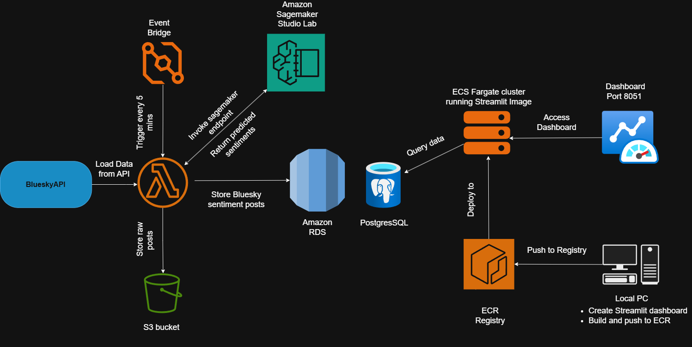

⚙️ End-to-End Architecture Workflow

1. Data Collection
A Lambda function is triggered every 5 minutes using Amazon EventBridge.
It fetches fresh posts from the Bluesky API.

2. Data Storage
The raw JSON data fetched from the API is stored in an Amazon S3 bucket for archival and reproducibility.

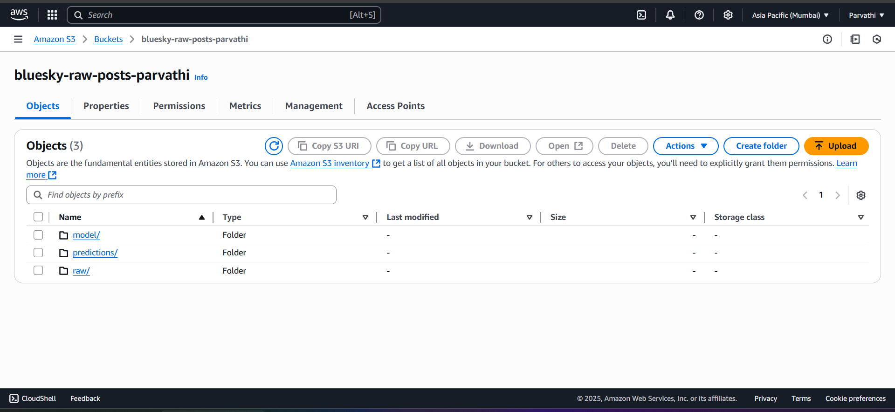
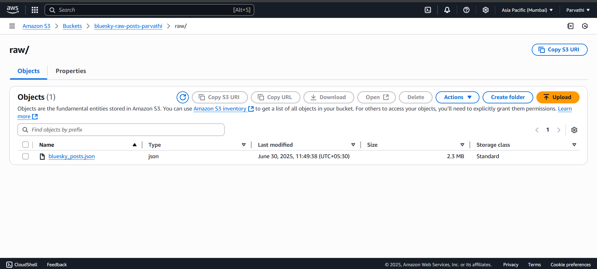

4. Sentiment Analysis
The same Lambda function invokes a SageMaker endpoint that analyses sentiments on the posts fetched by the lambda function and train a model and save it in the form of tar.gz format .
Here the sagemaker endpoint is created using Amazon Sagemaker Studio lab
The endpoint returns predicted sentiment labels (Positive, Neutral, Negative) along with the confidence_score for each post.

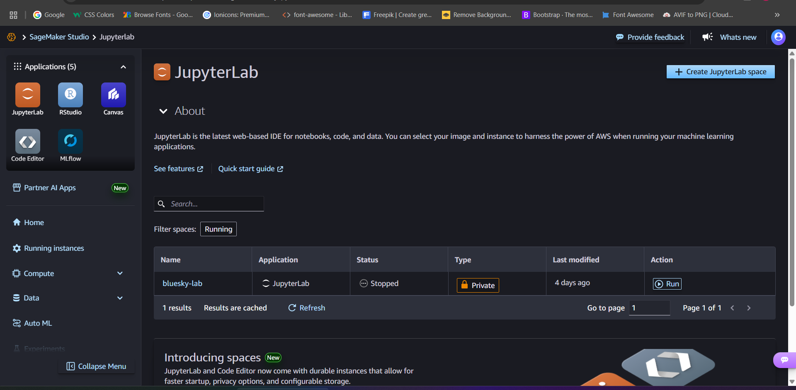
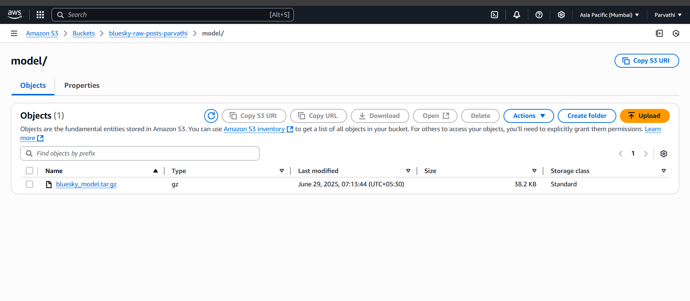
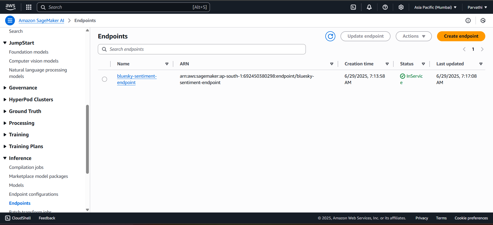

6. Database Storage
The predicted sentiment results, along with the original post content, are stored in an Amazon RDS PostgreSQL database.

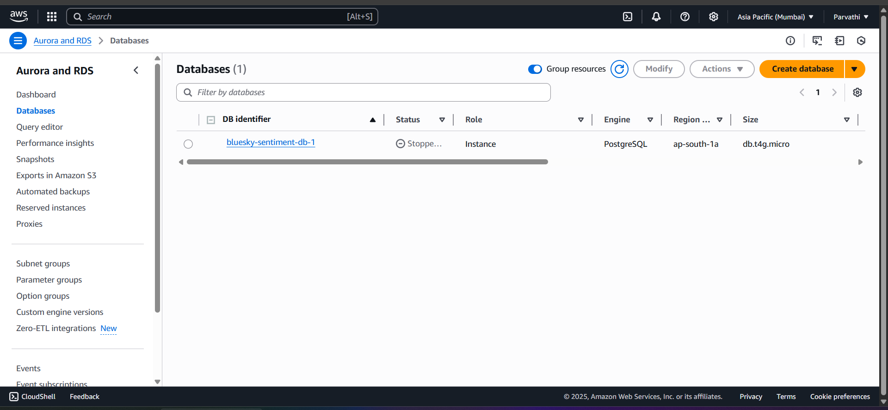
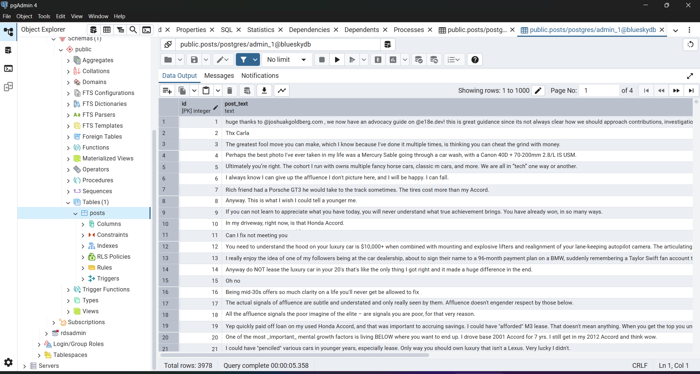


8. Dashboard Visualization
   
A Streamlit dashboard queries the RDS database for sentiment data.
The dashboard is containerized using Docker and deployed on ECS Fargate via Amazon ECR.

Docker commands
```bash
# Step 1: Build the Docker image
docker build -t bluesky-dashboard .
# Step 2: Authenticate Docker to your AWS ECR registry
aws ecr get-login-password | docker login --username AWS --password-stdin 692450380298.dkr.ecr.ap-south-1.amazonaws.com
# Step 3: Tag the image for ECR
docker tag bluesky-dashboard:latest 692450380298.dkr.ecr.ap-south-1.amazonaws.com/bluesky-dashboard
# Step 4: Push the image to ECR
docker push 692450380298.dkr.ecr.ap-south-1.amazonaws.com/bluesky-dashboard 
```

The dashboard runs on port 8051 and provides real-time sentiment insights.

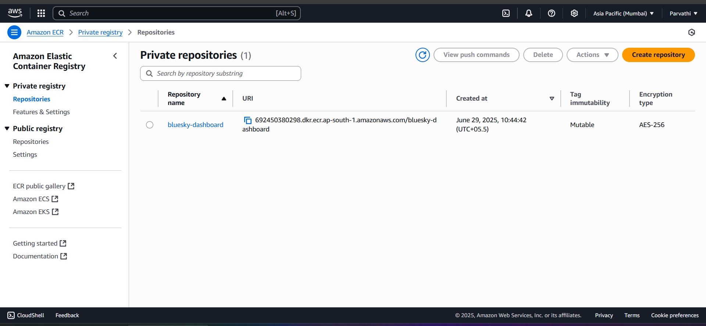
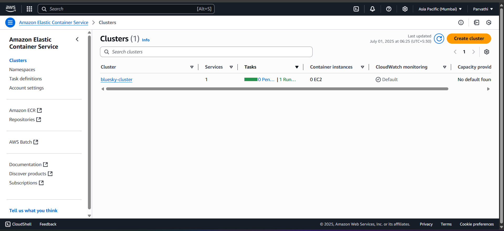
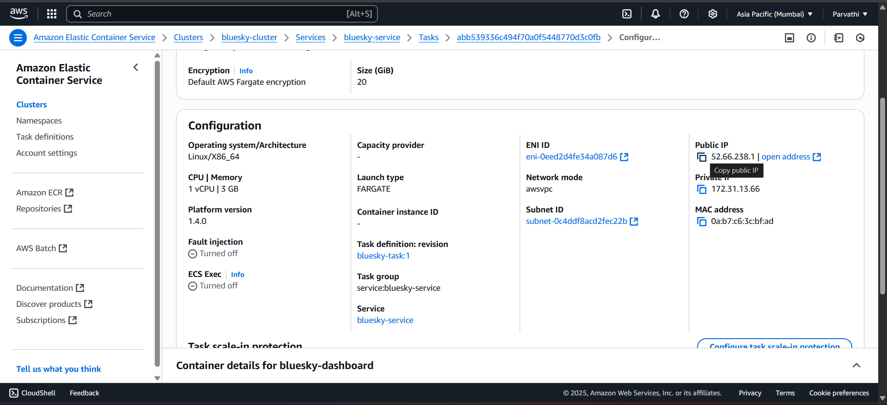
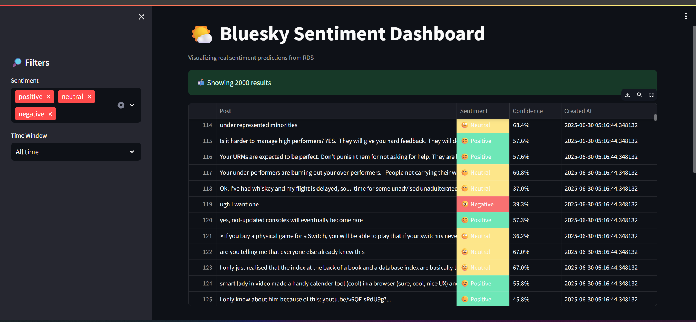


